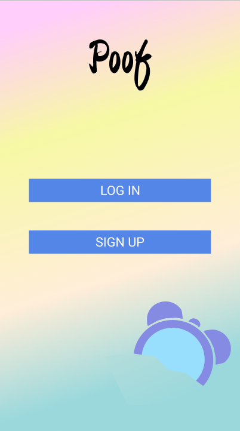
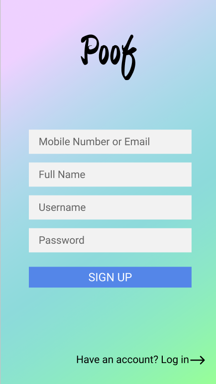
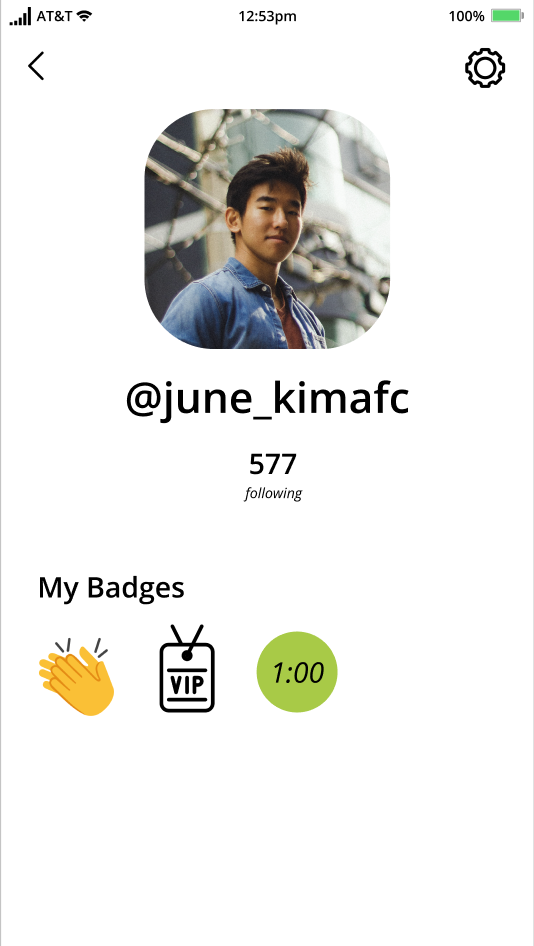

# Project Name: Limited Edition Social Media Platform

Introducing the next best social media! We're a platform that aims to maximize engagement while minimizing social clout. Gone are the like counters, the emphasis on who's following who and how high your follower count is. Instead, we restrict the number of unique views per post. Once a post's views are gone... *poof* the post also disappears. Welcome to a social media platform that breaks all the rules.

[#FeelingCuteMightDeleteLater](https://github.com/dartmouth-cs52-21S/project-limited-edition-social-media)

## Mock Up

Explore page (temporary gif until we come up with mockup): 

Standard View 

Searching in Standard View:

Sign-Up Flow: 

Create a post:

Profile View:

Live Commenting:

Messaging:

## Architecture

For all descriptions of code organization and tools and libraries used:
* React Native - to bring the app to your mobile devices
* Firebase/ MongoDB - database storage 
* Heroku - for deployment
* Amazon S3 - object storage 

## Setup

* `brew install node`
* `brew install watchman`
* `cd` into project repository (if not already there).
* `npm install`
* `expo start`
* Download the Expo Go app, create an account.
* Scan the QR code generated with your phone camera, making sure your phone is on the same network as wherever `expo start` was run.

## Deployment

1. Clone this repository in your favorite location:
    * (Client) `git clone git@github.com:dartmouth-cs52-21S/project-limited-edition-social-media.git`
    * (Backend) `git clone git@github.com:dartmouth-cs52-21S/project-api-limited-edition-social-media.git`

2. Install necessary dependencies using `npm install`
3. Run the application! `npm start` 

## Authors

The Team: 

  - Irene Lam
  - Jacob Werzinsky
  - Junhwi Kim
  - Maxwell Reiferson
  - Nalin Vattigunta
  - Sudharsan Balasubramani

## :heart: Acknowledgments :heart:

Acnowledgement to our professor, Tim Tregubov, and the amazing TAs for their insight and feedback!
