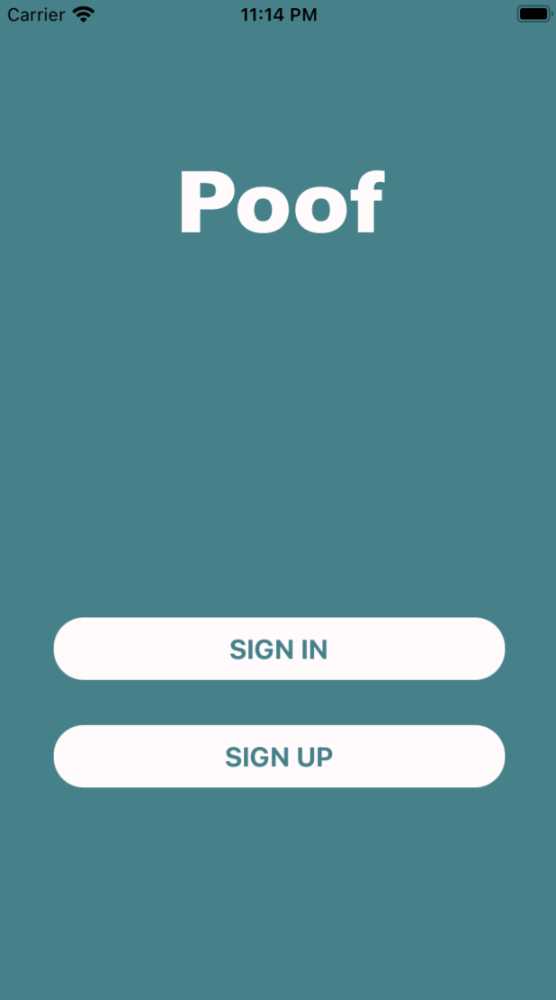
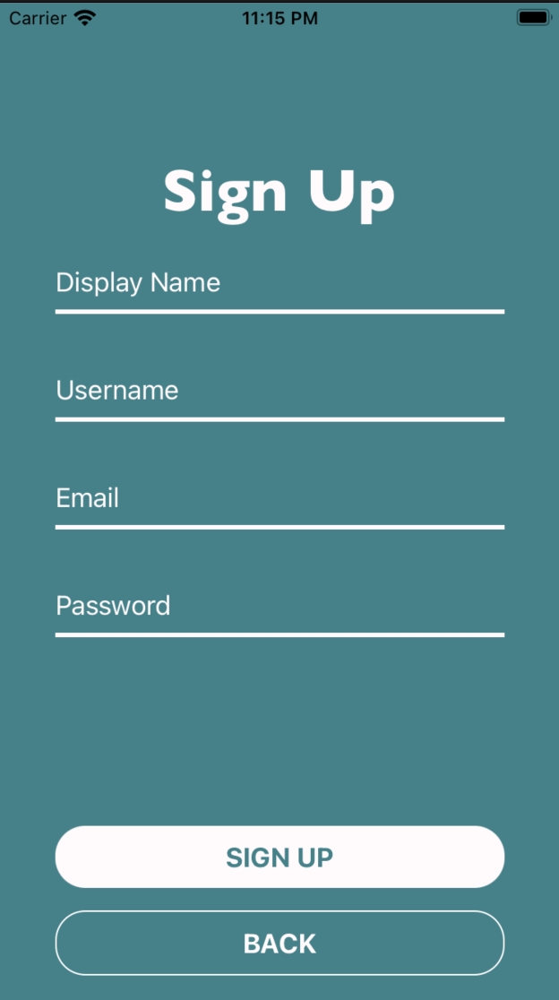
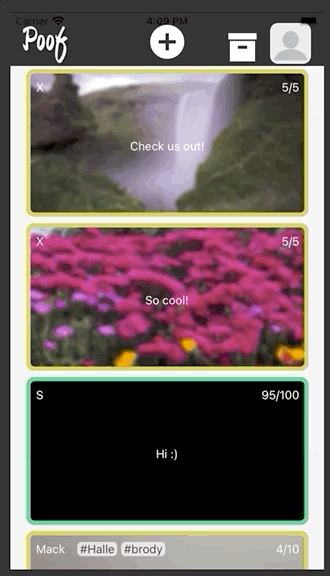
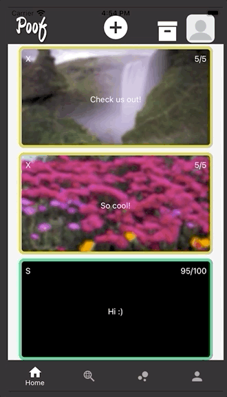
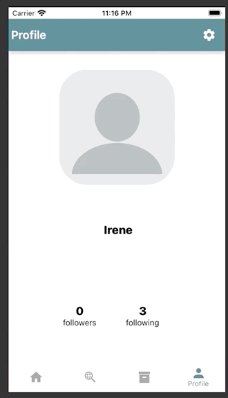
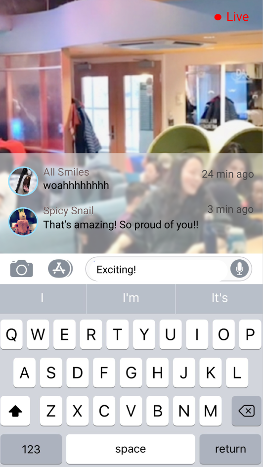
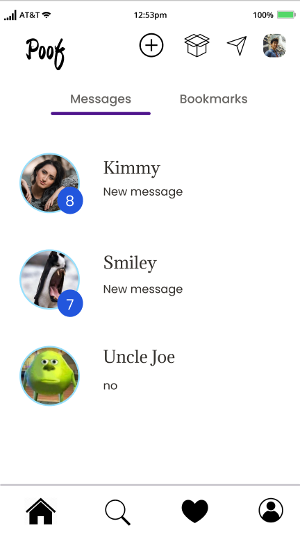
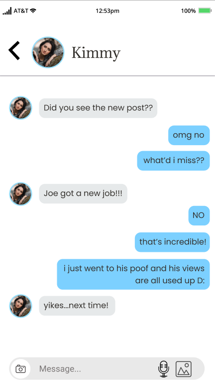

# Poof! (Limited Edition Social Media Platform)

## The Team

## Our Story

Introducing the next best social media! We're a platform that aims to **maximize engagement** while **minimizing social clout**. Gone are the like counters, the emphasis on who's following who and how high your follower count is. Instead, we restrict the number of unique views per post and give you the option to hide your follower/following count. Once a post's views are gone... *poof* the post also disappears. 

Our platform attempts to innovate on the existing social media landscape by giving users a bit more control over how their content is curated. We seek to improve transparency and enhance engagement.

Welcome to a social media platform that breaks all the rules.

[#FeelingCuteMightDeleteLater](https://github.com/dartmouth-cs52-21S/project-limited-edition-social-media)

## Our API
https://github.com/dartmouth-cs52-21S/project-api-limited-edition-social-media

## Mock Up

### Where everything begins:

### Sign-Up Flow:

### Main Feed: 

### Searching in Standard View:

### Create a post:

### Profile View:

### Archives:

**To bring you quality and functionality, we've had to make the difficult decision to do away with some reach goals. Some day, we'll bring you this:**

Omnidirectional feed

Live Commenting:

Messaging:

**There's also badges, an activities page, the whole galore...saved for posterity!**

## Architecture

For all descriptions of code organization and tools and libraries used:
* Figma - code scaffolding (see our prototype [here](https://www.figma.com/file/jhVNv2xzJKylPZacF5I5L0/Mockups?node-id=0%3A1)!)
* React Native - to bring the app to your mobile devices
* Firebase/ MongoDB - database storage 
* Heroku - for deployment
* Amazon S3 - object storage 
* React Native Paper + other visualization libraries - styling

## Setup

* `brew install node`
* `brew install watchman`
* `cd` into project repository (if not already there).
* `npm install`
* `expo start`
* Download the Expo Go app, create an account.
* Scan the QR code generated with your phone camera, making sure your phone is on the same network as wherever `expo start` was run.

Feel free to test with our Expo link:
* **Project Link:** https://expo.io/@sudbala/Poof
* **Username:** sudharsan.balasubramani.22@dartmouth.edu
* **Password:** limitededitioncs52

## Deployment

1. Clone this repository in your favorite location:
    * (Client) `git clone git@github.com:dartmouth-cs52-21S/project-limited-edition-social-media.git`
    * (Backend) `git clone git@github.com:dartmouth-cs52-21S/project-api-limited-edition-social-media.git`

2. Install necessary dependencies using `npm install`
3. Run the application! 
    * `expo start` on our client repository
    * `npm start` on our backend repository

## Authors

The Team:
- Sudharsan Balasubramani
- Junhwi Kim
- Irene Lam
- Maxwell Reiferson
- Nalin Vattigunta
- Jacob Werzinsky

## :heart: Acknowledgments :heart:

Much love to our professor, Tim Tregubov, and our amazing TAs for their insight and feedback!
